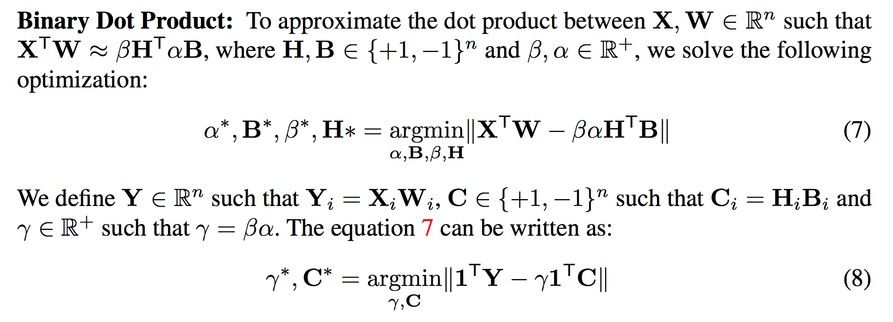

# Paper name:  [XNOR-Net: ImageNet Classification Using Binary Convolutional Neural Networks](https://pjreddie.com/media/files/papers/xnor.pdf)

## 1. Abstract

We propose **two efficient approximations** to standard convolutional
neural networks: **Binary-Weight-Networks** and **XNOR-Networks**. In Binary-WeightNetworks,
the filters are approximated with binary values resulting in 32× memory
saving. In XNOR-Networks, both the filters and the input to convolutional
layers are binary. XNOR-Networks approximate convolutions using primarily binary
operations. This results in 58× faster convolutional operations and 32×
memory savings. XNOR-Nets offer the possibility of running state-of-the-art
networks on CPUs (rather than GPUs) in real-time. Our binary networks are
simple, accurate, efficient, and work on challenging visual tasks. We evaluate
our approach on the ImageNet classification task. The classification accuracy
with a Binary-Weight-Network version of AlexNet is only 2.9% less than the
full-precision AlexNet (in top-1 measure). We compare our method with recent
network binarization methods, BinaryConnect and BinaryNets, and outperform
these methods by large margins on ImageNet, more than 16% in top-1 accuracy.

## 2 Related Work

Deep neural networks often suffer from **over-parametrization** and **large amounts of redundancy**
in their models. This typically results in inefficient computation and memory
usage[12]. Several methods have been proposed to address efficient training and inference
in deep neural networks.

**Shallow networks:** Estimating a deep neural network with a shallower model reduces
the size of a network. Early theoretical by Cybenko shows a network with a
large enough single hidden layer of sigmoid units can approximate any decision boundary
[13]. 

**Compressing pre-trained deep networks:** Pruning redundant, non-informative
weights in a previously trained network reduces the size of the network at inference
time. 

**Compressing pre-trained deep networks**: Pruning redundant, non-informative
weights in a previously trained network reduces the size of the network at inference
time. Weight decay [17] was an early method for pruning a network. Optimal Brain
Damage [18] and Optimal Brain Surgeon [19] use the **Hessian of the loss function to
prune a network by reducing the number of connections**. Recently [20] **reduced the
number of parameters by an order of magnitude** in several state-of-the-art neural networks
by pruning. [21] proposed to reduce the number of activations for compression
and acceleration. Deep compression [22] reduces the storage and energy required to run
inference on large networks so they can be deployed on mobile devices. They remove
the redundant connections and quantize weights so that multiple connections share the
same weight, and then they use **Huffman coding** to compress the weights. **HashedNets**
[23] uses a hash function to reduce model size by randomly grouping the weights, such
that connections in a hash bucket use a single parameter value. Matrix factorization has
4 Rastegari et al.been used by [24,25]. **We are different from these approaches because we do not use a
pretrained network. We train binary networks from scratch.**

**Designing compact layers: Designing compact blocks at each layer of a deep network**
can help to save memory and computational costs. Replacing the fully connected
layer with global average pooling was examined in the Network in Network architecture
[26], GoogLenet[3] and Residual-Net[4], which achieved state-of-the-art results
on several benchmarks. The bottleneck structure in Residual-Net [4] has been proposed
to reduce the number of parameters and improve speed. **Decomposing 3 × 3 convolutions
with two 1 × 1** is used in [27] and resulted in state-of-the-art performance on
object recognition. **Replacing 3 × 3 convolutions with 1 × 1 convolutions** is used in
[28] to create a very compact neural network that can achieve ∼ 50× reduction in the
number of parameters while obtaining high accuracy. Our method is different from this
line of work because we use the full network (not the compact version) but with binary
parameters.

**Quantizing parameters**: High precision parameters are not very important in achieving
high performance in deep networks. [29] proposed to quantize the weights of fully
connected layers in deep network by vector quantization techniques. They showed just
thresholding the weight values at zero only decreases the top-1 accuracy on ILSVRC2012
by less than %10. [30] proposed a provably polynomial time algorithm for training a
sparse networks with +1/0/-1 weights. A fixedpoint implementation of 8-bit integer was
compared with 32-bit floating point activations in [31]. Another fixed-point network
with ternary weights and 3-bits activations presented by [32]. Quantizing a network
with L2 error minimization achieved better accuracy on MNIST and CIFAR-10 datasets
in [33]. Back-propagation process by quantizing the representations at each layer of the
network was presented in [34] to convert some of the remaining multiplications into
binary shifts by restricting the neuron values of power-of-two integers. They carry the
full precision weights during the test phase, and only quantize the neurons during the
back-propagation process, and not during the forward-propagation. Our work is similar
to these methods since we are quantizing the parameters in the network. **But our
quantization is the extreme scenario +1,-1.**

## 3 Binary Convolutional Neural Network

## 4. XNOR-Networks

