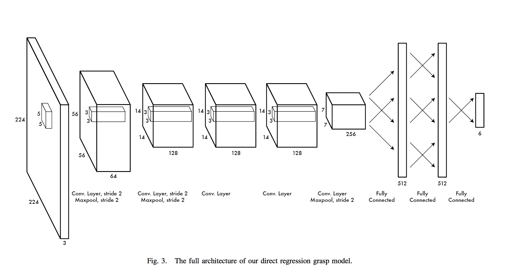
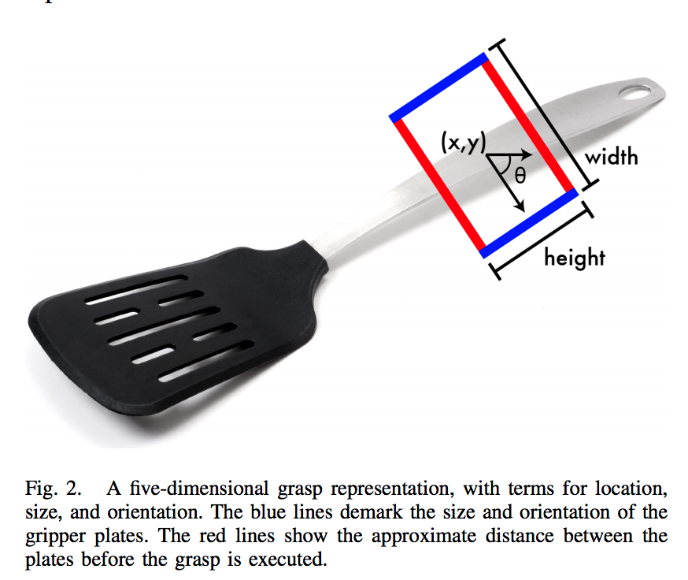
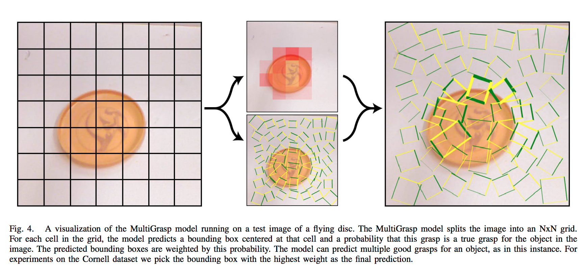
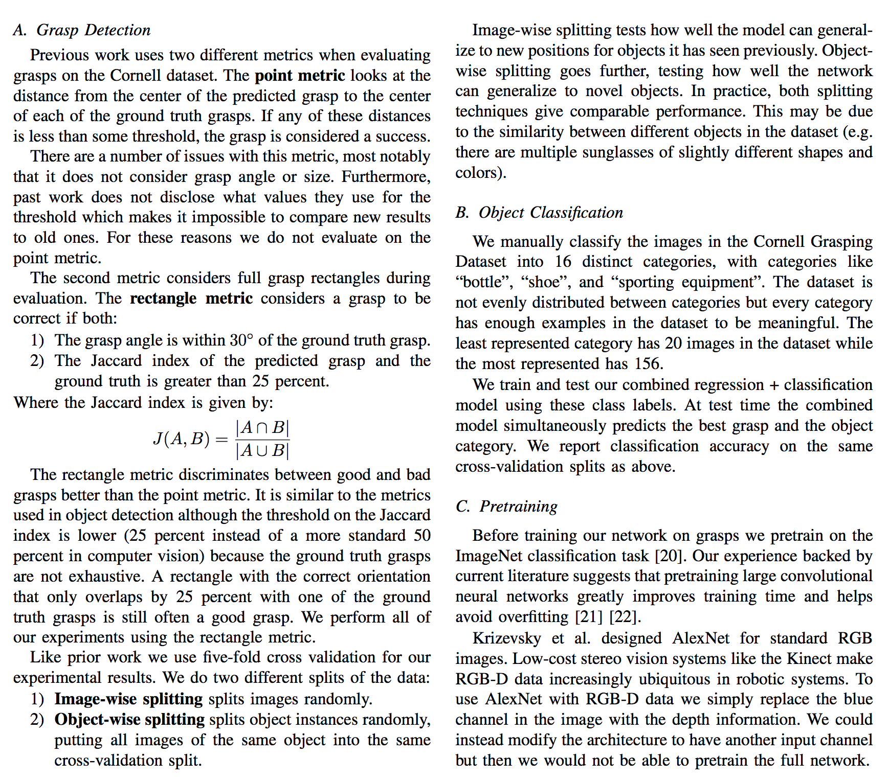
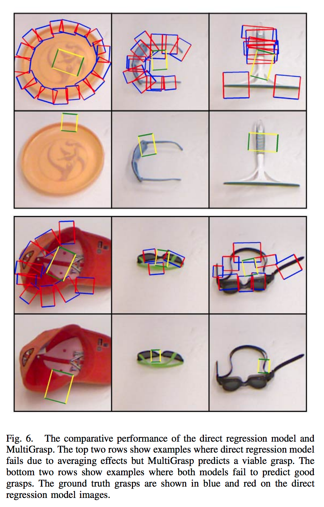
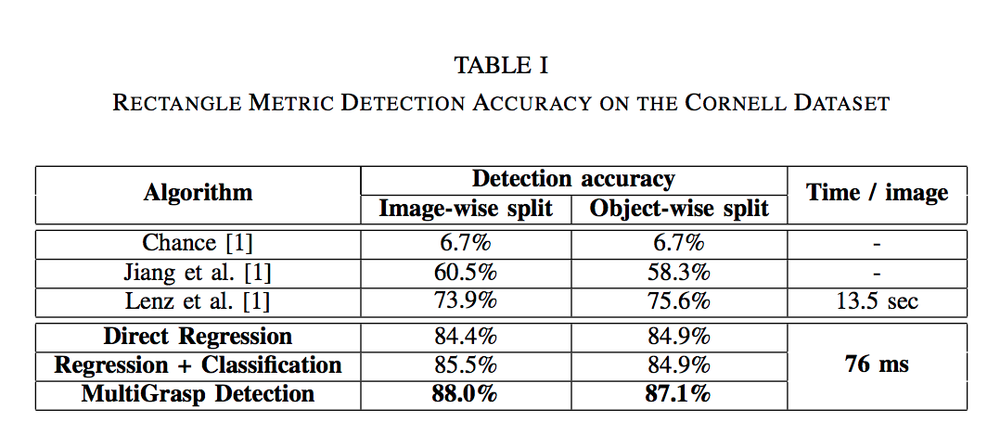

## Paper name: Real-Time Grasp Detection Using Convolutional Neural Networks

link( https://arxiv.org/abs/1412.3128 )

**Paper abstract:**

Abstract— We present an accurate, real-time approach to robotic grasp detection based on convolutional neural networks. Our network performs single-stage regression to graspable bounding boxes without using standard sliding window or region proposal techniques. The model outperforms state-of-the-art approaches by 14 percentage points and runs at 13 frames per second on a GPU. Our network can simultaneously perform classification so that in a single step it recognizes the object and finds a good grasp rectangle. A modification to this model predicts multiple grasps per object by using a locally constrained prediction mechanism. The locally constrained model performs significantly better, especially on objects that can be grasped in a variety of ways.

## Notes

**A. Architecture: Raw image -> 5layerCNN → 3layerFC --->ouput 6**

When building our grasp detection system we want to start from a strong foundation. We derive our model from a version of the widely adopted convolutional network proposed by Krizhevsky et al. for object recognition tasks (AlexNet) [15]. Our network has five convolutional layers followed by three fully connected layers. The convolutional layers are interspersed with normalization and maxpooling layers at various stages. A full description of the architecture can be found in Figure 3.

The fully connected layers terminate in an output layer with six output neurons corresponding to the coordinates of a grasp. Four of the neurons correspond to location and height. Grasp angles are two-fold rotationally symmetric so we parameterize by using the two additional coordinates: the sine and cosine of twice the angle.

**B. Loss function: L2 loss**

During training our model picks a random ground truth grasp every time it sees an object to treat as the single ground truth grasp. Because the grasp changes often, the model does not overfit to a single grasp on an object. We minimize the squared error of the predicted grasp. The end effect is that our model fits to the average of the possible grasps for an object.

**C. Regression + Classification**

We modify our architecture from the previous section by adding extra neurons to the output layer that correspond to object categories. We keep the rest of the architecture the same thus our model uses common features from the convolutional layers for both recognition and detection. This combined model processes an image in a single pass and predicts both the category of the object in the image and a good grasp for that object. It runs just as fast as the direct regression model because the architecture remains largely unchanged

**D. MultiGrasp Detection **

Our third model is a generalization of the first model, we call it MultiGrasp. The preceeding models assume that there is only a single correct grasp per image and try to predict that grasp. MultiGrasp divides the image into an NxN grid and assumes that there is at most one grasp per grid cell.The output of this model is an NxNx7 prediction **(new loss function now!). The first channel is a heatmap of how likely a region is to contain a correct grasp** . The other six channels contain the predicted grasp coordinates for that region. For experiments on the Cornell dataset we used a 7x7 grid, making the actual output layer 7x7x7 or 343 neurons. Our first model can be seen as a specific case of this model with a grid size of 1x1 where the probability of the grasp existing in the single cell is implicitly one. 

**E. Training MultiGrasp **

Every time MultiGrasp sees an image it randomly picks up to five grasps to treat as ground truth. It constructs a heatmap with up to five cells marked with ones and the rest filled with zeros. It also calculates which cells those grasps fall into and fills in the appropriate columns of the ground truth with the grasp coordinates. During training we do not backpropagate error for the entire 7x7x7 grid because many of the column entries are blank (if there is no grasp in that cell). Instead we backpropagate error for the entire heatmap channel and also for the specific cells that contain ground truth grasps.

**F. Result**

Accuracy definition

