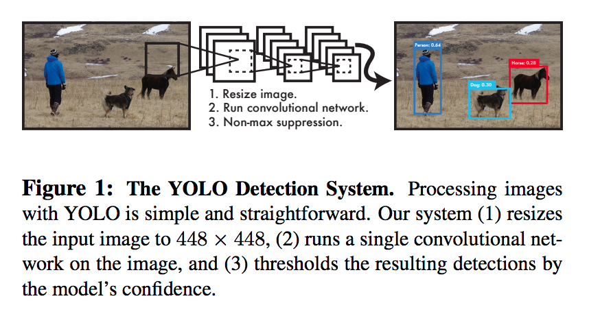

# Paper name [You Only Look Once: Unified, Real-Time Object Detection](https://pjreddie.com/media/files/papers/yolo_1.pdf)

**Abstract**

We present YOLO, a new approach to object detection.
Prior work on object detection repurposes classifiers to perform
detection. Instead, we frame object detection as a regression
problem to spatially separated bounding boxes and
associated class probabilities. A single neural network predicts
bounding boxes and class probabilities directly from
full images in one evaluation. Since the whole detection
pipeline is a single network, it can be optimized end-to-end
directly on detection performance.
Our unified architecture is extremely fast. Our base
YOLO model processes images in real-time at 45 frames
per second. A smaller version of the network, Fast YOLO,
processes an astounding 155 frames per second while
still achieving double the mAP of other real-time detectors.
Compared to state-of-the-art detection systems, YOLO
makes more localization errors but is less likely to predict
false positives on background. Finally, YOLO learns very
general representations of objects. It outperforms other detection
methods, including DPM and R-CNN, when generalizing
from natural images to other domains like artwork.

**Previous model**

Systems like deformable <b style='color:red'>parts models (DPM)</b> use a sliding window approach where the
classifier is run at evenly spaced locations over the entire image [10].
More recent approaches like <b style='color:red'>R-CNN</b> use region proposal methods to first generate potential bounding boxes in an image
and then run a classifier on these proposed boxes. After
classification, post-processing is used to refine the bounding
boxes, eliminate duplicate detections, and rescore the
boxes based on other objects in the scene [13]. These complex
pipelines are slow and hard to optimize because each
individual component must be trained separately.

**you only look once (YOLO)**

We reframe object detection as a single regression problem,
straight from image pixels to bounding box coordinates
and class probabilities. Using our system, you only
look once (YOLO) at an image to predict what objects are
present and where they are.YOLO is refreshingly simple: see Figure 1. A single convolutional network simultaneously predicts multiple bounding boxes and class probabilities for those boxes. YOLO trains on full images and directly optimizes detection performance. This unified model has several benefits over traditional methods of object detection.

**advantage**

- First, YOLO is extremely fast. Since we frame detection
as a regression problem we don’t need a complex pipeline.
We simply run our neural network on a new image at test
time to predict detections

- Second, YOLO reasons globally about the image when making predictions. Unlike sliding window and region
proposal-based techniques, YOLO sees the entire image
during training and test time so it implicitly encodes contextual
information about classes as well as their appearance.
Fast R-CNN, a top detection method [14], mistakes background
patches in an image for objects because it can’t see
the larger context. YOLO makes less than half the number
of background errors compared to Fast R-CNN.

- Third, YOLO learns generalizable representations of objects.
When trained on natural images and tested on artwork,
YOLO outperforms top detection methods like DPM
and R-CNN by a wide margin. Since YOLO is highly generalizable
it is less likely to break down when applied to
new domains or unexpected inputs.

**How it works**

Our system divides the input image into an S × S grid.
If the center of an object falls into a grid cell, that grid cell
is responsible for detecting that object.
Each grid cell predicts B bounding boxes and confidence
scores for those boxes. These confidence scores reflect how
confident the model is that the box contains an object and
also how accurate it thinks the box is that it predicts.

**The Architecture**

